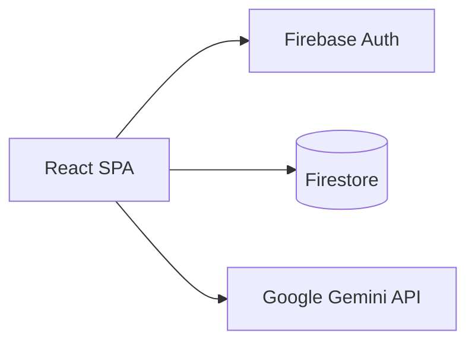

# Arquitetura — Cogniux

## Stack

| Camada | Tecnologia |
|--------|------------|
| UI | React 19, TypeScript strict, Tailwind CSS v4 |
| Componentes | shadcn/ui (`src/components/ui/`) — **não editar manualmente salvo necessidade** |
| Roteamento | React Router v7 |
| Estado servidor | TanStack Query v5 + Firestore listeners |
| Auth | Firebase Auth (Google + Microsoft popup) |
| Banco | Firestore (database ID custom via env) |
| IA | `@google/genai` — modelo `gemini-3-flash-preview` |
| Forms | react-hook-form + zod |
| Toast | sonner |
| Build | Vite 6 |
| Testes | Vitest (funções puras + serviços mockados) |
| Alias | `@/` → `src/` |

## Bootstrap (`src/main.tsx`)

```
validateEnv() → applyTheme() → initAuthQuery()
→ QueryClientProvider → ErrorBoundary → BrowserRouter → AppRouter
```

## Estrutura de pastas

```
src/
├── components/          # Páginas e UI de feature
│   ├── ui/              # shadcn gerado (55+ componentes)
│   ├── Dashboard.tsx
│   ├── ExamCreator.tsx
│   ├── ExamDetail.tsx
│   ├── OnlineExam.tsx
│   ├── StudentPortal.tsx
│   ├── Header.tsx
│   └── ErrorBoundary.tsx
├── hooks/
│   ├── firestore/       # useFirestoreCollectionQuery, useFirestoreDocQuery
│   ├── useAuth.ts
│   ├── useExams.ts
│   ├── useExamDetail.ts
│   ├── useSubmissionScores.ts
│   ├── useOnlineExamSession.ts
│   └── useTheme.ts
├── lib/                 # Funções puras e infra
│   ├── env.ts           # zod — GEMINI + VITE_FIREBASE_*
│   ├── firebase.ts      # initializeApp, auth, db
│   ├── queryClient.ts   # TanStack QueryClient + initAuthQuery
│   ├── queryKeys.ts     # chaves centralizadas
│   ├── grading.ts       # calculateScore, getScoreColorClass
│   ├── examStats.ts
│   ├── export.ts        # CSV
│   ├── accessCode.ts
│   ├── gemini.ts        # parseJsonResponse
│   ├── retry.ts
│   └── theme.ts
├── routes/
│   ├── AppRouter.tsx
│   ├── ProtectedRoute.tsx
│   └── ProfessorLayout.tsx
├── services/
│   ├── geminiPrompts.ts # builders de prompt + system instructions
│   └── geminiService.ts # chamadas Gemini API
└── types/
    └── index.ts         # tipos de domínio
```

## Camadas e responsabilidades

```
┌─────────────────────────────────────────┐
│  components/ (UI + eventos + mutations) │
├─────────────────────────────────────────┤
│  hooks/ (TanStack Query + Firestore)    │
├─────────────────────────────────────────┤
│  services/ (Gemini API)                 │
│  lib/ (pure functions, env, firebase)   │
└─────────────────────────────────────────┘
```

- **Mutations Firestore** hoje ficam nos componentes (`addDoc`, `updateDoc`, etc.), não em hooks dedicados
- **Leituras** passam por hooks com TanStack Query
- **Lógica testável** deve ir para `src/lib/` ou `src/services/`

## TanStack Query + Firestore

Padrão para dados em tempo real:

1. `queryFn` faz `getDocs` / `getDoc` inicial
2. `useEffect` + `onSnapshot` atualiza cache via `queryClient.setQueryData`
3. `staleTime: Infinity` — sem refetch automático

Hooks base: `src/hooks/firestore/`

Chaves: `src/lib/queryKeys.ts` — **sempre usar**, nunca strings soltas.

Auth: `onAuthStateChanged` → `setQueryData(queryKeys.auth, { user, ready })`.

## Variáveis de ambiente

| Variável | Uso |
|----------|-----|
| `GEMINI_API_KEY` | Injetada via `vite.config.ts` `define` → `process.env` |
| `VITE_FIREBASE_*` | Config Firebase client (expostas pelo Vite) |

Validação: `src/lib/env.ts` → `validateEnv()` no boot.

## Firebase

- Init: `src/lib/firebase.ts`
- Regras: `firestore.rules` (raiz) — alunos podem `get` exam e `create` submission sem auth
- **Não há** Cloud Functions no repo; Gemini roda no browser (limitação de segurança)

## Estilo e UI

- Tema shadcn neutro, dark mode via classe `.dark` em `<html>`
- `useTheme` persiste em `localStorage`, aplica no setter (sem useEffect)
- Ícones: lucide-react
- Print CSS em `src/index.css` (classes `.print-only`, `.no-print`, `.page-break`)

## Testes

```
src/lib/*.test.ts           # funções puras
src/services/geminiService.test.ts   # mock @google/genai
```

Não há testes de componente (RTL) nem E2E no repo.

## Build e qualidade

```bash
npm run lint    # eslint src && tsc --noEmit
npm run build   # tsc + vite build
```

TypeScript: `strict: true`, `noUnusedLocals`, `noUnusedParameters`.

## Diagrama de dependências externas


